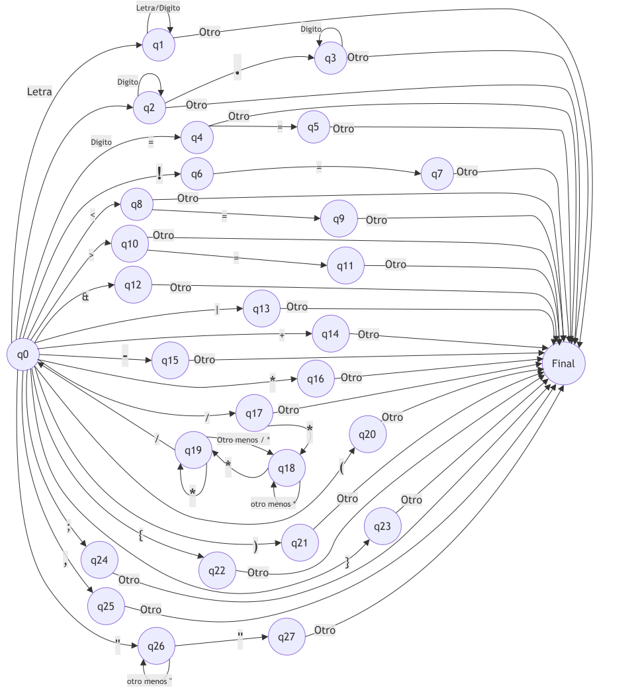

# Spec — Analizador léxico de UNO

**Grupo:** ejemplo de cátedra · **Lenguaje de implementación:** C
**Depende de:** `specs/01-diseno/spec.md`
**Produce:** `src/lexico/` · escribe en la tabla de símbolos definida en `specs/02-tabla-simbolos/spec.md`

---

## 1. Alcance e interfaz

Función `yylex()` invocada por el analizador sintáctico. Devuelve **un token por
llamada**, como entero asociado al número de token. No es una pasada previa que
produzca la lista completa.

## 2. Decisiones propias de esta fase

| # | Decisión | Valor |
|---|---|---|

---

## 3. Eventos (columnas de las matrices)

`get_evento(c)` mapea el carácter leído a una columna:

| Col | Evento | Caracteres |
|---|---|---|

---

## 4. Estados y Diagrama

| Estado | Significado |
|---|---|

---

## 5. Acciones semánticas

| Acción | Qué hace |
|---|---|

---

## 6. Automata Finito

---

## 7. Matriz de Nuevos Estados

`nuevo_estado[estado][evento]`

---

| Descripción                  | ESTADOS | letra | digito | \=  | !     | <     | \>    | &     | \|    | +     | \-    | \*    | /     | (     | )     | {     | }     | ;     | ,     | .     | "     | otro  |
| ---------------------------- | ------- | ----- | ------ | --- | ----- | ----- | ----- | ----- | ----- | ----- | ----- | ----- | ----- | ----- | ----- | ----- | ----- | ----- | ----- | ----- | ----- | ----- |
| inicio                       | q0      | q1    | q2     | q4  | q6    | q8    | q10   | q12   | q13   | q14   | q15   | q16   | q17   | q20   | q21   | q22   | q23   | q24   | q25   | error | q26   | error |
| id o palabra reservada       | q1      | q1    | q1     | f   | f     | f     | f     | f     | f     | f     | f     | f     | f     | f     | f     | f     | f     | f     | f     | f     | f     | f     |
| constante entera o real      | q2      | f     | q2     | f   | f     | f     | f     | f     | f     | f     | f     | f     | f     | f     | f     | f     | f     | f     | f     | q3    | f     | f     |
| constante real               | q3      | f     | q3     | f   | f     | f     | f     | f     | f     | f     | f     | f     | f     | f     | f     | f     | f     | f     | f     | f     | f     | f     |
| posible asignacion           | q4      | f     | f      | q5  | f     | f     | f     | f     | f     | f     | f     | f     | f     | f     | f     | f     | f     | f     | f     | f     | f     | f     |
| igual                        | q5      | f     | f      | f   | f     | f     | f     | f     | f     | f     | f     | f     | f     | f     | f     | f     | f     | f     | f     | f     | f     | f     |
| posible distinto             | q6      | error | error  | q7  | error | error | error | error | error | error | error | error | error | error | error | error | error | error | error | error | error | error |
| distinto confirmado          | q7      | f     | f      | f   | f     | f     | f     | f     | f     | f     | f     | f     | f     | f     | f     | f     | f     | f     | f     | f     | f     | f     |
| menor o menor igual          | q8      | f     | f      | q9  | f     | f     | f     | f     | f     | f     | f     | f     | f     | f     | f     | f     | f     | f     | f     | f     | f     | f     |
| menor igual confirmado       | q9      | f     | f      | f   | f     | f     | f     | f     | f     | f     | f     | f     | f     | f     | f     | f     | f     | f     | f     | f     | f     | f     |
| mayor o mayor igual          | q10     | f     | f      | q11 | f     | f     | f     | f     | f     | f     | f     | f     | f     | f     | f     | f     | f     | f     | f     | f     | f     | f     |
| mayor igual confirmado       | q11     | f     | f      | f   | f     | f     | f     | f     | f     | f     | f     | f     | f     | f     | f     | f     | f     | f     | f     | f     | f     | f     |
| and                          | q12     | f     | f      | f   | f     | f     | f     | f     | f     | f     | f     | f     | f     | f     | f     | f     | f     | f     | f     | f     | f     | f     |
| or                           | q13     | f     | f      | f   | f     | f     | f     | f     | f     | f     | f     | f     | f     | f     | f     | f     | f     | f     | f     | f     | f     | f     |
| suma                         | q14     | f     | f      | f   | f     | f     | f     | f     | f     | f     | f     | f     | f     | f     | f     | f     | f     | f     | f     | f     | f     | f     |
| resta                        | q15     | f     | f      | f   | f     | f     | f     | f     | f     | f     | f     | f     | f     | f     | f     | f     | f     | f     | f     | f     | f     | f     |
| producto                     | q16     | f     | f      | f   | f     | f     | f     | f     | f     | f     | f     | f     | f     | f     | f     | f     | f     | f     | f     | f     | f     | f     |
| division o inicio comentario | q17     | f     | f      | f   | f     | f     | f     | f     | f     | f     | f     | q18   | f     | f     | f     | f     | f     | f     | f     | f     | f     | f     |
| inicio comentario            | q18     | q18   | q18    | q18 | q18   | q18   | q18   | q18   | q18   | q18   | q18   | q19   | q18   | q18   | q18   | q18   | q18   | q18   | q18   | q18   | q18   | q18   |
| posible fin comentario       | q19     | q18   | q18    | q18 | q18   | q18   | q18   | q18   | q18   | q18   | q18   | q19   | q0    | q18   | q18   | q18   | q18   | q18   | q18   | q18   | q18   | q18   |
| parentesis abre              | q20     | f     | f      | f   | f     | f     | f     | f     | f     | f     | f     | f     | f     | f     | f     | f     | f     | f     | f     | f     | f     | f     |
| parentesis cierra            | q21     | f     | f      | f   | f     | f     | f     | f     | f     | f     | f     | f     | f     | f     | f     | f     | f     | f     | f     | f     | f     | f     |
| llave abre                   | q22     | f     | f      | f   | f     | f     | f     | f     | f     | f     | f     | f     | f     | f     | f     | f     | f     | f     | f     | f     | f     | f     |
| llave cierra                 | q23     | f     | f      | f   | f     | f     | f     | f     | f     | f     | f     | f     | f     | f     | f     | f     | f     | f     | f     | f     | f     | f     |
| fin de linea                 | q24     | f     | f      | f   | f     | f     | f     | f     | f     | f     | f     | f     | f     | f     | f     | f     | f     | f     | f     | f     | f     | f     |
| coma                         | q25     | f     | f      | f   | f     | f     | f     | f     | f     | f     | f     | f     | f     | f     | f     | f     | f     | f     | f     | f     | f     | f     |
| inicio cadena                | q26     | q26   | q26    | q26 | q26   | q26   | q26   | q26   | q26   | q26   | q26   | q26   | q26   | q26   | q26   | q26   | q26   | q26   | q26   | q26   | f     | q26   |
| fin cadena                   | q27     | f     | f      | f   | f     | f     | f     | f     | f     | f     | f     | f     | f     | f     | f     | f     | f     | f     | f     | f     | f     | f     |

---

## 8. Matriz de Transiciones

`proceso[estado][evento]`

---

| Descripción                  | ESTADOS | letra   | digito  | \=      | !       | <       | \>      | &       | \|      | +       | \-      | \*      | /       | (       | )       | {       | }       | ;       | ,       | .       | "       | ESP-TAB | otro    |
| ---------------------------- | ------- | ------- | ------- | ------- | ------- | ------- | ------- | ------- | ------- | ------- | ------- | ------- | ------- | ------- | ------- | ------- | ------- | ------- | ------- | ------- | ------- | ------- | ------- |
| inicio                       | q0      | q1-f1   | q2-f2   | q4-fn   | q6-fn   | q8-fn   | q10-fn  | q12-fn  | q13-fn  | q14-fn  | q15-fn  | q16-fn  | q17-fn  | q20-fn  | q21-fn  | q22-fn  | q23-fn  | q24-fn  | q25-fn  | f-error | q26-f10 | fn      | f-error |
| id o palabra reservada       | q1      | q1-f3   | q1-f3   | f-f4    | f-f4    | f-f4    | f-f4    | f-f4    | f-f4    | f-f4    | f-f4    | f-f4    | f-f4    | f-f4    | f-f4    | f-f4    | f-f4    | f-f4    | f-f4    | f-f4    | f-f4    | f-f4    | f-f4    |
| constante entera o real      | q2      | f-f6    | q2-f5   | f-f6    | f-f6    | f-f6    | f-f6    | f-f6    | f-f6    | f-f6    | f-f6    | f-f6    | f-f6    | f-f6    | f-f6    | f-f6    | f-f6    | f-f6    | f-f6    | q3-f7   | f-f6    | f-f6    | f-f6    |
| constante real               | q3      | f-f9    | q3-f8   | f-f9    | f-f9    | f-f9    | f-f9    | f-f9    | f-f9    | f-f9    | f-f9    | f-f9    | f-f9    | f-f9    | f-f9    | f-f9    | f-f9    | f-f9    | f-f9    | f-f9    | f-f9    | f-f9    | f-f9    |
| posible asignacion           | q4      | f-fn    | f-fn    | f-fn    | f-fn    | f-fn    | f-fn    | f-fn    | f-fn    | f-fn    | f-fn    | f-fn    | f-fn    | f-fn    | f-fn    | f-fn    | f-fn    | f-fn    | f-fn    | f-fn    | f-fn    | f-fn    | f-fn    |
| igual                        | q5      | f-fn    | f-fn    | f-fn    | f-fn    | f-fn    | f-fn    | f-fn    | f-fn    | f-fn    | f-fn    | f-fn    | f-fn    | f-fn    | f-fn    | f-fn    | f-fn    | f-fn    | f-fn    | f-fn    | f-fn    | f-fn    | f-fn    |
| posible distinto             | q6      | f-error | f-error | q7-fn   | f-error | f-error | f-error | f-error | f-error | f-error | f-error | f-error | f-error | f-error | f-error | f-error | f-error | f-error | f-error | f-error | f-error | f-error | f-error |
| distinto confirmado          | q7      | f-fn    | f-fn    | f-fn    | f-fn    | f-fn    | f-fn    | f-fn    | f-fn    | f-fn    | f-fn    | f-fn    | f-fn    | f-fn    | f-fn    | f-fn    | f-fn    | f-fn    | f-fn    | f-fn    | f-fn    | f-fn    | f-fn    |
| menor o menor igual          | q8      | f-fn    | f-fn    | q9-fn   | f-fn    | f-fn    | f-fn    | f-fn    | f-fn    | f-fn    | f-fn    | f-fn    | f-fn    | f-fn    | f-fn    | f-fn    | f-fn    | f-fn    | f-fn    | f-fn    | f-fn    | f-fn    | f-fn    |
| menor igual confirmado       | q9      | f-fn    | f-fn    | f-fn    | f-fn    | f-fn    | f-fn    | f-fn    | f-fn    | f-fn    | f-fn    | f-fn    | f-fn    | f-fn    | f-fn    | f-fn    | f-fn    | f-fn    | f-fn    | f-fn    | f-fn    | f-fn    | f-fn    |
| mayor o mayor igual          | q10     | f-fn    | f-fn    | q11-fn  | f-fn    | f-fn    | f-fn    | f-fn    | f-fn    | f-fn    | f-fn    | f-fn    | f-fn    | f-fn    | f-fn    | f-fn    | f-fn    | f-fn    | f-fn    | f-fn    | f-fn    | f-fn    | f-fn    |
| mayor igual confirmado       | q11     | f-fn    | f-fn    | f-fn    | f-fn    | f-fn    | f-fn    | f-fn    | f-fn    | f-fn    | f-fn    | f-fn    | f-fn    | f-fn    | f-fn    | f-fn    | f-fn    | f-fn    | f-fn    | f-fn    | f-fn    | f-fn    | f-fn    |
| and                          | q12     | f-fn    | f-fn    | f-fn    | f-fn    | f-fn    | f-fn    | f-fn    | f-fn    | f-fn    | f-fn    | f-fn    | f-fn    | f-fn    | f-fn    | f-fn    | f-fn    | f-fn    | f-fn    | f-fn    | f-fn    | f-fn    | f-fn    |
| or                           | q13     | f-fn    | f-fn    | f-fn    | f-fn    | f-fn    | f-fn    | f-fn    | f-fn    | f-fn    | f-fn    | f-fn    | f-fn    | f-fn    | f-fn    | f-fn    | f-fn    | f-fn    | f-fn    | f-fn    | f-fn    | f-fn    | f-fn    |
| suma                         | q14     | f-fn    | f-fn    | f-fn    | f-fn    | f-fn    | f-fn    | f-fn    | f-fn    | f-fn    | f-fn    | f-fn    | f-fn    | f-fn    | f-fn    | f-fn    | f-fn    | f-fn    | f-fn    | f-fn    | f-fn    | f-fn    | f-fn    |
| resta                        | q15     | f-fn    | f-fn    | f-fn    | f-fn    | f-fn    | f-fn    | f-fn    | f-fn    | f-fn    | f-fn    | f-fn    | f-fn    | f-fn    | f-fn    | f-fn    | f-fn    | f-fn    | f-fn    | f-fn    | f-fn    | f-fn    | f-fn    |
| producto                     | q16     | f-fn    | f-fn    | f-fn    | f-fn    | f-fn    | f-fn    | f-fn    | f-fn    | f-fn    | f-fn    | f-fn    | f-fn    | f-fn    | f-fn    | f-fn    | f-fn    | f-fn    | f-fn    | f-fn    | f-fn    | f-fn    | f-fn    |
| division o inicio comentario | q17     | f-fn    | f-fn    | f-fn    | f-fn    | f-fn    | f-fn    | f-fn    | f-fn    | f-fn    | f-fn    | q18-f13 | f-fn    | f-fn    | f-fn    | f-fn    | f-fn    | f-fn    | f-fn    | f-fn    | f-fn    | f-fn    | f-fn    |
| inicio comentario            | q18     | q18-f13 | q18-f13 | q18-f13 | q18-f13 | q18-f13 | q18-f13 | q18-f13 | q18-f13 | q18-f13 | q18-f13 | q19-f13 | q18-f13 | q18-f13 | q18-f13 | q18-f13 | q18-f13 | q18-f13 | q18-f13 | q18-f13 | q18-f13 | q18-f13 | q18-f13 |
| posible fin comentario       | q19     | q18     | q18     | q18-f13 | q18-f13 | q18-f13 | q18-f13 | q18-f13 | q18-f13 | q18-f13 | q18-f13 | q19-f13 | q0-f13  | q18-f13 | q18-f13 | q18-f13 | q18-f13 | q18-f13 | q18-f13 | q18-f13 | q18-f13 | q18-f13 | q18-f13 |
| parentesis abre              | q20     | f-fn    | f-fn    | f-fn    | f-fn    | f-fn    | f-fn    | f-fn    | f-fn    | f-fn    | f-fn    | f-fn    | f-fn    | f-fn    | f-fn    | f-fn    | f-fn    | f-fn    | f-fn    | f-fn    | f-fn    | f-fn    | f-fn    |
| parentesis cierra            | q21     | f-fn    | f-fn    | f-fn    | f-fn    | f-fn    | f-fn    | f-fn    | f-fn    | f-fn    | f-fn    | f-fn    | f-fn    | f-fn    | f-fn    | f-fn    | f-fn    | f-fn    | f-fn    | f-fn    | f-fn    | f-fn    | f-fn    |
| llave abre                   | q22     | f-fn    | f-fn    | f-fn    | f-fn    | f-fn    | f-fn    | f-fn    | f-fn    | f-fn    | f-fn    | f-fn    | f-fn    | f-fn    | f-fn    | f-fn    | f-fn    | f-fn    | f-fn    | f-fn    | f-fn    | f-fn    | f-fn    |
| llave cierra                 | q23     | f-fn    | f-fn    | f-fn    | f-fn    | f-fn    | f-fn    | f-fn    | f-fn    | f-fn    | f-fn    | f-fn    | f-fn    | f-fn    | f-fn    | f-fn    | f-fn    | f-fn    | f-fn    | f-fn    | f-fn    | f-fn    | f-fn    |
| fin de linea                 | q24     | f-fn    | f-fn    | f-fn    | f-fn    | f-fn    | f-fn    | f-fn    | f-fn    | f-fn    | f-fn    | f-fn    | f-fn    | f-fn    | f-fn    | f-fn    | f-fn    | f-fn    | f-fn    | f-fn    | f-fn    | f-fn    | f-fn    |
| coma                         | q25     | f-fn    | f-fn    | f-fn    | f-fn    | f-fn    | f-fn    | f-fn    | f-fn    | f-fn    | f-fn    | f-fn    | f-fn    | f-fn    | f-fn    | f-fn    | f-fn    | f-fn    | f-fn    | f-fn    | f-fn    | f-fn    | f-fn    |
| inicio cadena                | q26     | q26-f11 | q26-f11 | q26-f11 | q26-f11 | q26-f11 | q26-f11 | q26-f11 | q26-f11 | q26-f11 | q26-f11 | q26-f11 | q26-f11 | q26-f11 | q26-f11 | q26-f11 | q26-f11 | q26-f11 | q26-f11 | q26-f11 | q27-f12 | q26-f11 | q26-f11 |
| fin cadena                   | q27     | f-fn    | f-fn    | f-fn    | f-fn    | f-fn    | f-fn    | f-fn    | f-fn    | f-fn    | f-fn    | f-fn    | f-fn    | f-fn    | f-fn    | f-fn    | f-fn    | f-fn    | f-fn    | f-fn    | f-fn    | f-fn    | f-fn    |

---

| FUNCIONES                        | DESCRIPCION                                                                                                          |
| -------------------------------- | -------------------------------------------------------------------------------------------------------------------- |
| f1 (iniciar bufer id)            | : limpia el bufe, asigna el tipo "identificador" y almacena el caracter                                              |
| f2 (iniciar bufer de numero)     | : limpia el bufer de texto, asigna el tipo "constante numerica" y guarda el primer digito                            |
| f3 (acumular y validar id)       | : agrega la letra o digito al bufer, controla la restricción de 20 caracteres, pasado los 20 no los agrega al bufer  |
| f4 (reconocer id/pal reservada)  | : finaliza la recolección, busca en la tabla de palabras reservadas, si no existe asigna la categorira de token a id |
| f5 (acumular entero)             | : añade el dígito al bufer                                                                                           |
| f6 (reconocer y validar entero)  | : finaliza la constante entera, convierte el texto acumulado a entero y comprueba el rango, si exede notifica        |
| f7 (acumular real/ transición)   | : agrega el punto al bufer de enteros para transformarlo a real, inicializa el contador de mantiza                   |
| f8 (acumular real)               | : agrega el digito decimal al bufer de reales                                                                        |
| f9 (reconocer y validar real)    | : finaliza la constante real, comprueba el rango, si exede notifica                                                  |
| f10 (iniciar cadena)             | : limpia el bufer y almacena el string sin comillas                                                                  |
| f11 (acumular cadena)            | : agrega cualquier caracter dentro del cuerpo de la cadena                                                           |
| f12 (reconocer cadena)           | : cierra el almacenamiento de la constante                                                                           |
| f13 (ignorar caracter)           | : utilizado en el cuerpo y cierre de comentarios, descarta lo leido sin guardarlo                                    |
| fn (función nula)                | : no realiza ninguna modificación sobre el bufer                                                                     |
| f-error (manejo de error lexico) | : reporta carácter no valido o secuencia erronea                                                                     |

---

## 9. Tabla de Unreads

`Sí` = el carácter leído no pertenece al token que se cerró y debe devolverse al
flujo (`unget`).

---

| Descripción                  | ESTADOS | letra | digito | \= | ! | < | \> | & | \| | + | \- | \* | / | ( | ) | { | } | ; | , | . | " | ESP-TAB | otro |
| ---------------------------- | ------- | ----- | ------ | -- | - | - | -- | - | -- | - | -- | -- | - | - | - | - | - | - | - | - | - | ------- | ---- |
| inicio                       | q0      | 0     | 0      | 0  | 0 | 0 | 0  | 0 | 0  | 0 | 0  | 0  | 0 | 0 | 0 | 0 | 0 | 0 | 0 | 0 | 0 | 0       | 0    |
| id o palabra reservada       | q1      | 0     | 0      | 1  | 1 | 1 | 1  | 1 | 1  | 1 | 1  | 1  | 1 | 1 | 1 | 1 | 1 | 1 | 1 | 1 | 1 | 0       | 1    |
| constante entera o real      | q2      | 1     | 0      | 1  | 1 | 1 | 1  | 1 | 1  | 1 | 1  | 1  | 1 | 1 | 1 | 1 | 1 | 1 | 1 | 0 | 1 | 0       | 1    |
| constante real               | q3      | 1     | 0      | 1  | 1 | 1 | 1  | 1 | 1  | 1 | 1  | 1  | 1 | 1 | 1 | 1 | 1 | 1 | 1 | 1 | 1 | 0       | 1    |
| posible asignacion           | q4      | 1     | 1      | 0  | 1 | 1 | 1  | 1 | 1  | 1 | 1  | 1  | 1 | 1 | 1 | 1 | 1 | 1 | 1 | 1 | 1 | 0       | 1    |
| igual                        | q5      | 1     | 1      | 1  | 1 | 1 | 1  | 1 | 1  | 1 | 1  | 1  | 1 | 1 | 1 | 1 | 1 | 1 | 1 | 1 | 1 | 0       | 1    |
| posible distinto             | q6      | 1     | 1      | 0  | 1 | 1 | 1  | 1 | 1  | 1 | 1  | 1  | 1 | 1 | 1 | 1 | 1 | 1 | 1 | 1 | 1 | 0       | 1    |
| distinto confirmado          | q7      | 1     | 1      | 1  | 1 | 1 | 1  | 1 | 1  | 1 | 1  | 1  | 1 | 1 | 1 | 1 | 1 | 1 | 1 | 1 | 1 | 0       | 1    |
| menor o menor igual          | q8      | 1     | 1      | 0  | 1 | 1 | 1  | 1 | 1  | 1 | 1  | 1  | 1 | 1 | 1 | 1 | 1 | 1 | 1 | 1 | 1 | 0       | 1    |
| menor igual confirmado       | q9      | 1     | 1      | 1  | 1 | 1 | 1  | 1 | 1  | 1 | 1  | 1  | 1 | 1 | 1 | 1 | 1 | 1 | 1 | 1 | 1 | 0       | 1    |
| mayor o mayor igual          | q10     | 1     | 1      | 0  | 1 | 1 | 1  | 1 | 1  | 1 | 1  | 1  | 1 | 1 | 1 | 1 | 1 | 1 | 1 | 1 | 1 | 0       | 1    |
| mayor igual confirmado       | q11     | 1     | 1      | 1  | 1 | 1 | 1  | 1 | 1  | 1 | 1  | 1  | 1 | 1 | 1 | 1 | 1 | 1 | 1 | 1 | 1 | 0       | 1    |
| and                          | q12     | 1     | 1      | 1  | 1 | 1 | 1  | 1 | 1  | 1 | 1  | 1  | 1 | 1 | 1 | 1 | 1 | 1 | 1 | 1 | 1 | 0       | 1    |
| or                           | q13     | 1     | 1      | 1  | 1 | 1 | 1  | 1 | 1  | 1 | 1  | 1  | 1 | 1 | 1 | 1 | 1 | 1 | 1 | 1 | 1 | 0       | 1    |
| suma                         | q14     | 1     | 1      | 1  | 1 | 1 | 1  | 1 | 1  | 1 | 1  | 1  | 1 | 1 | 1 | 1 | 1 | 1 | 1 | 1 | 1 | 0       | 1    |
| resta                        | q15     | 1     | 1      | 1  | 1 | 1 | 1  | 1 | 1  | 1 | 1  | 1  | 1 | 1 | 1 | 1 | 1 | 1 | 1 | 1 | 1 | 0       | 1    |
| producto                     | q16     | 1     | 1      | 1  | 1 | 1 | 1  | 1 | 1  | 1 | 1  | 1  | 1 | 1 | 1 | 1 | 1 | 1 | 1 | 1 | 1 | 0       | 1    |
| division o inicio comentario | q17     | 1     | 1      | 1  | 1 | 1 | 1  | 1 | 1  | 1 | 1  | 0  | 1 | 1 | 1 | 1 | 1 | 1 | 1 | 1 | 1 | 0       | 1    |
| inicio comentario            | q18     | 0     | 0      | 0  | 0 | 0 | 0  | 0 | 0  | 0 | 0  | 0  | 0 | 0 | 0 | 0 | 0 | 0 | 0 | 0 | 0 | 0       | 0    |
| posible fin comentario       | q19     | 0     | 0      | 0  | 0 | 0 | 0  | 0 | 0  | 0 | 0  | 0  | 0 | 0 | 0 | 0 | 0 | 0 | 0 | 0 | 0 | 0       | 0    |
| parentesis abre              | q20     | 1     | 1      | 1  | 1 | 1 | 1  | 1 | 1  | 1 | 1  | 1  | 1 | 1 | 1 | 1 | 1 | 1 | 1 | 1 | 1 | 0       | 1    |
| parentesis cierra            | q21     | 1     | 1      | 1  | 1 | 1 | 1  | 1 | 1  | 1 | 1  | 1  | 1 | 1 | 1 | 1 | 1 | 1 | 1 | 1 | 1 | 0       | 1    |
| llave abre                   | q22     | 1     | 1      | 1  | 1 | 1 | 1  | 1 | 1  | 1 | 1  | 1  | 1 | 1 | 1 | 1 | 1 | 1 | 1 | 1 | 1 | 0       | 1    |
| llave cierra                 | q23     | 1     | 1      | 1  | 1 | 1 | 1  | 1 | 1  | 1 | 1  | 1  | 1 | 1 | 1 | 1 | 1 | 1 | 1 | 1 | 1 | 0       | 1    |
| fin de linea                 | q24     | 1     | 1      | 1  | 1 | 1 | 1  | 1 | 1  | 1 | 1  | 1  | 1 | 1 | 1 | 1 | 1 | 1 | 1 | 1 | 1 | 0       | 1    |
| coma                         | q25     | 1     | 1      | 1  | 1 | 1 | 1  | 1 | 1  | 1 | 1  | 1  | 1 | 1 | 1 | 1 | 1 | 1 | 1 | 1 | 1 | 0       | 1    |
| inicio cadena                | q26     | 0     | 0      | 0  | 0 | 0 | 0  | 0 | 0  | 0 | 0  | 0  | 0 | 0 | 0 | 0 | 0 | 0 | 0 | 0 | 0 | 0       | 0    |
| fin cadena                   | q27     | 1     | 1      | 1  | 1 | 1 | 1  | 1 | 1  | 1 | 1  | 1  | 1 | 1 | 1 | 1 | 1 | 1 | 1 | 1 | 1 | 0       | 1    |

---

## 10. Matriz de tokens

| Descripción                  | Estado (q) | letra | digito | \=  | !   | <   | \>  | &   | \|  | +   | \-  | \*  | /   | (   | )   | {   | }   | ;   | ,   | .   | "   | otro |
| ---------------------------- | ---------- | ----- | ------ | --- | --- | --- | --- | --- | --- | --- | --- | --- | --- | --- | --- | --- | --- | --- | --- | --- | --- | ---- |
| inicio                       | q0         | q1    | q2     | q4  | q6  | q8  | q10 | q12 | q13 | q14 | q15 | q16 | q17 | q20 | q21 | q22 | q23 | q24 | q25 | q27 | q26 | \-2  |
| id o palabra reservada       | q1         | q1    | q1     | \-1 | \-1 | \-1 | \-1 | \-1 | \-1 | \-1 | \-1 | \-1 | \-1 | \-1 | \-1 | \-1 | \-1 | \-1 | \-1 | \-1 | \-1 | \-1  |
| constante entera o real      | q2         | 101   | q2     | 101 | 101 | 101 | 101 | 101 | 101 | 101 | 101 | 101 | 101 | 101 | 101 | 101 | 101 | 101 | 101 | q3  | 101 | 101  |
| constante real               | q3         | 102   | q3     | 102 | 102 | 102 | 102 | 102 | 102 | 102 | 102 | 102 | 102 | 102 | 102 | 102 | 102 | 102 | 102 | 102 | 102 | 102  |
| posible asignacion           | q4         | 111   | 111    | q5  | 111 | 111 | 111 | 111 | 111 | 111 | 111 | 111 | 111 | 111 | 111 | 111 | 111 | 111 | 111 | 111 | 111 | 111  |
| igual                        | q5         | 112   | 112    | 112 | 112 | 112 | 112 | 112 | 112 | 112 | 112 | 112 | 112 | 112 | 112 | 112 | 112 | 112 | 112 | 112 | 112 | 112  |
| posible distinto             | q6         | \-2   | \-2    | q7  | \-2 | \-2 | \-2 | \-2 | \-2 | \-2 | \-2 | \-2 | \-2 | \-2 | \-2 | \-2 | \-2 | \-2 | \-2 | \-2 | \-2 | \-2  |
| distinto confirmado          | q7         | 113   | 113    | 113 | 113 | 113 | 113 | 113 | 113 | 113 | 113 | 113 | 113 | 113 | 113 | 113 | 113 | 113 | 113 | 113 | 113 | 113  |
| menor o menor igual          | q8         | 114   | 114    | q9  | 114 | 114 | 114 | 114 | 114 | 114 | 114 | 114 | 114 | 114 | 114 | 114 | 114 | 114 | 114 | 114 | 114 | 114  |
| menor igual confirmado       | q9         | 116   | 116    | 116 | 116 | 116 | 116 | 116 | 116 | 116 | 116 | 116 | 116 | 116 | 116 | 116 | 116 | 116 | 116 | 116 | 116 | 116  |
| mayor o mayor igual          | q10        | 115   | 115    | q11 | 115 | 115 | 115 | 115 | 115 | 115 | 115 | 115 | 115 | 115 | 115 | 115 | 115 | 115 | 115 | 115 | 115 | 115  |
| mayor igual confirmado       | q11        | 117   | 117    | 117 | 117 | 117 | 117 | 117 | 117 | 117 | 117 | 117 | 117 | 117 | 117 | 117 | 117 | 117 | 117 | 117 | 117 | 117  |
| and                          | q12        | 118   | 118    | 118 | 118 | 118 | 118 | 118 | 118 | 118 | 118 | 118 | 118 | 118 | 118 | 118 | 118 | 118 | 118 | 118 | 118 | 118  |
| or                           | q13        | 119   | 119    | 119 | 119 | 119 | 119 | 119 | 119 | 119 | 119 | 119 | 119 | 119 | 119 | 119 | 119 | 119 | 119 | 119 | 119 | 119  |
| suma                         | q14        | 120   | 120    | 120 | 120 | 120 | 120 | 120 | 120 | 120 | 120 | 120 | 120 | 120 | 120 | 120 | 120 | 120 | 120 | 120 | 120 | 120  |
| resta                        | q15        | 121   | 121    | 121 | 121 | 121 | 121 | 121 | 121 | 121 | 121 | 121 | 121 | 121 | 121 | 121 | 121 | 121 | 121 | 121 | 121 | 121  |
| producto                     | q16        | 122   | 122    | 122 | 122 | 122 | 122 | 122 | 122 | 122 | 122 | 122 | 122 | 122 | 122 | 122 | 122 | 122 | 122 | 122 | 122 | 122  |
| division o inicio comentario | q17        | 123   | 123    | 123 | 123 | 123 | 123 | 123 | 123 | 123 | 123 | q18 | 123 | 123 | 123 | 123 | 123 | 123 | 123 | 123 | 123 | 123  |
| inicio comentario            | q18        | q18   | q18    | q18 | q18 | q18 | q18 | q18 | q18 | q18 | q18 | q19 | q18 | q18 | q18 | q18 | q18 | q18 | q18 | q18 | q18 | q18  |
| posible fin comentario       | q19        | q18   | q18    | q18 | q18 | q18 | q18 | q18 | q18 | q18 | q18 | q19 | q0  | q18 | q18 | q18 | q18 | q18 | q18 | q18 | q18 | q18  |
| parentesis abre              | q20        | 124   | 124    | 124 | 124 | 124 | 124 | 124 | 124 | 124 | 124 | 124 | 124 | 124 | 124 | 124 | 124 | 124 | 124 | 124 | 124 | 124  |
| parentesis cierra            | q21        | 125   | 125    | 125 | 125 | 125 | 125 | 125 | 125 | 125 | 125 | 125 | 125 | 125 | 125 | 125 | 125 | 125 | 125 | 125 | 125 | 125  |
| llave abre                   | q22        | 126   | 126    | 126 | 126 | 126 | 126 | 126 | 126 | 126 | 126 | 126 | 126 | 126 | 126 | 126 | 126 | 126 | 126 | 126 | 126 | 126  |
| llave cierra                 | q23        | 127   | 127    | 127 | 127 | 127 | 127 | 127 | 127 | 127 | 127 | 127 | 127 | 127 | 127 | 127 | 127 | 127 | 127 | 127 | 127 | 127  |
| fin de linea                 | q24        | 128   | 128    | 128 | 128 | 128 | 128 | 128 | 128 | 128 | 128 | 128 | 128 | 128 | 128 | 128 | 128 | 128 | 128 | 128 | 128 | 128  |
| coma                         | q25        | 129   | 129    | 129 | 129 | 129 | 129 | 129 | 129 | 129 | 129 | 129 | 129 | 129 | 129 | 129 | 129 | 129 | 129 | 129 | 129 | 129  |
| inicio cadena                | q26        | q26   | q26    | q26 | q26 | q26 | q26 | q26 | q26 | q26 | q26 | q26 | q26 | q26 | q26 | q26 | q26 | q26 | q26 | q26 | q27 | q26  |
| fin cadena                   | q27        | 132   | 132    | 132 | 132 | 132 | 132 | 132 | 132 | 132 | 132 | 132 | 132 | 132 | 132 | 132 | 132 | 132 | 132 | 132 | 132 | 132  |

---

## 11. Errores que emite esta fase

| Código | Condición | Mensaje |
|---|---|---|

---

## 12. Traza de verificación

Entrada ``, con el estado inicial 0:

| Estado | Lee | Evento | Acción | Nuevo estado | Unread | Retorna |
|---|---|---|---|---|---|---|

---

## 13. Casos de prueba de esta fase

| Entrada | Salida esperada | Qué verifica |
|---|---|---|
