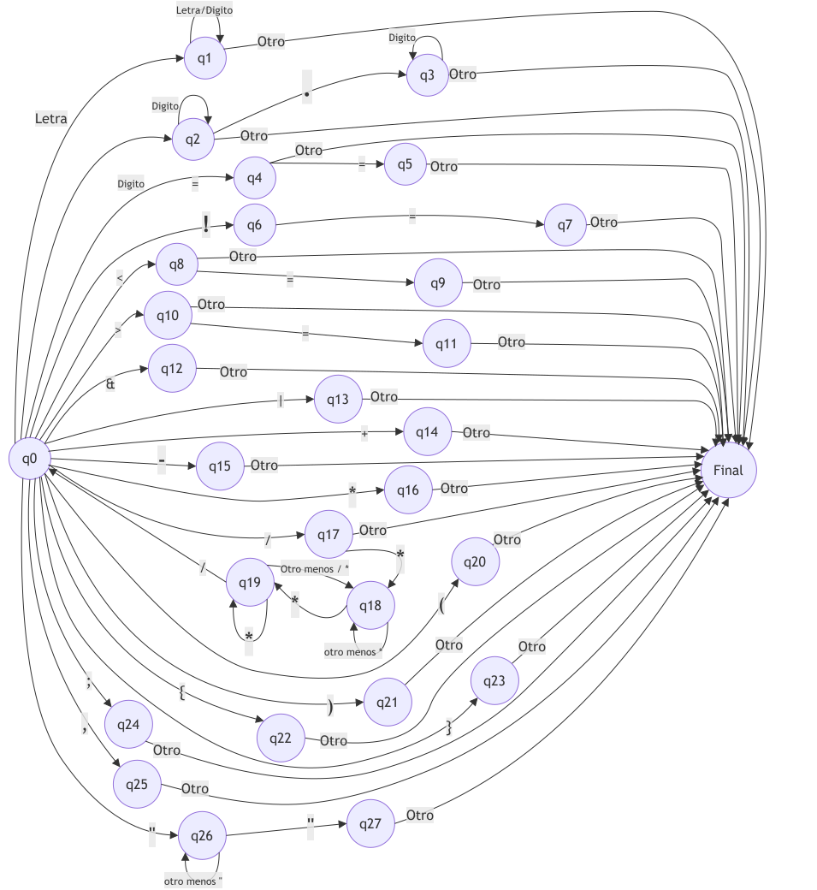

# Spec — Analizador léxico de beta

**Grupo:** B · **Lenguaje de implementación:** C
**Depende de:** `specs/01-diseno/spec.md`
**Produce:** tokens y valores léxicos para el analizador sintáctico · consulta la tabla
de palabras reservadas y, cuando corresponda, la tabla de símbolos definida en
`specs/02-tabla-simbolos/spec.md`.

---

## 1. Alcance e interfaz

El analizador léxico recibe un archivo fuente de beta y lo recorre de izquierda a
derecha, una sola vez, produciendo un token por llamada a `yylex()`. No realiza
validación sintáctica ni semántica.

En pseudocodigo:

```c
yylex(){

  estado = 0     // estado inicial
  // estado_final = -1
  // estado_error = -2

  estado_anterior = 0
  columna_anterior = 0

  while (estado != -1 and estado != -2){  // mientras no sea fin o error
    
    c = leer_caracter()   // guardo caracter leido

    columna = get_evento(c)    // numero de columna en base a caracter leido

    estado_anterior = estado
    columna_anterior = columna

    proceso[estado][columna]    // ejecutamos la funcion correspondiente
    
    estado = nuevo_estado[estado][columna]    // guardamos el nuevo estado

  }

  si (unread[estado_anterior][columna] == 1){ // si la celda indica unread ejecutamos unread()
          unread(c)
  }

  si (estado == -2){
      retornar ERROR_LEXICO
  } 

  retornar token_matriz[estado_anterior][columna_anterior]  // retornamos token
}
```

```c

main(){

  si (no hay archivo o archivo incorrecto) {
    imprimir("Error, debe modificar el archivo de entrada")
    retornar 1
  }

  archivo = abrir_archivo("archivo.beta", "r")

  si (archivo == NULL){
    imprimir("Archivo vacio")
    retornar 1
  }

  error_detectado = 0

  while (not fin_archivo(archivo)){
    token = yylex()   // llamo al AL y guardo el token

    si (token == ERROR_LEXICO){
      error_detectado = error_detectado + 1
    }
    sino {
      imprimir_token(linea, numero_token, nombre_token, lexema)
    }
  }
  cerrar_archivo(archivo)

  si (error_detectado == 0) {
    imprimir("Compilacion exitosa")
    mostrarTS()   // mostramos la tabla de simbolos
  } sino {
    imprimir("Analisis lexico completo con errores")
  }

  retornar 0
}

```

Cada llamada consume caracteres hasta formar el siguiente lexema, actualiza el
valor semántico y la ubicación asociada, y devuelve el código de token definido
en `specs/01-diseno/spec.md`. Los espacios, tabuladores, saltos de línea y
comentarios se consumen y no generan tokens. Los errores léxicos se notifican
mediante el mecanismo de diagnóstico del compilador, el lexer no debe devolver
un token válido para un lexema inválido.

### 1.1 Entrada, salida y estado persistente

| Elemento | Contrato |
|---|---|
| Entrada | Secuencia de caracteres del archivo fuente, interpretada según el alfabeto de diseño. |
| Salida principal | Código entero del token reconocido. |
| Valor semántico | Lexema normalizado o valor convertido, según el token. |
| Ubicación | Línea y columna iniciales y finales del lexema. |
| Errores | Diagnóstico con código, mensaje, lexema involucrado y ubicación. |

El lexer conserva como máximo un carácter de la pila de reads: cuando una
transición termina antes de consumir el carácter siguiente, ese carácter se
devuelve mediante `unread()` para procesarlo desde el estado inicial.

## 2. Decisiones propias de esta fase

| # | Decisión | Valor |
|---|---|---|
| L1 | Estrategia | Autómata finito determinista implementado con las matrices de esta especificación. |
| L2 | Lectura | Máxima coincidencia: se consume el lexema más largo válido antes de finalizarlo. |
| L3 | Prioridad | Palabras reservadas se resuelven después de reconocer un identificador. |
| L4 | Identificadores | Comienzan con letra y continúan con letras o dígitos. Son sensibles a mayúsculas. |
| L5 | Longitud | Se conservan los primeros 20 caracteres y se emite advertencia si se supera el límite, el token usa el lexema truncado. |
| L6 | Números | Sólo se admiten enteros y reales con una única parte decimal. |
| L7 | Punto | Un punto aislado no es un token válido. Un punto después de dígitos inicia la forma real. |
| L8 | Cadenas | Se delimitan por `"`, no admiten escapes (`/n, /t, etc`), pueden contener cualquier carácter excepto `"` y EOF y sólo son válidas en el contexto sintáctico de `imprimir`. |
| L9 | Comentarios | Son de bloque, delimitados por `/*` y `*/`, no se anidan y pueden abarcar líneas. |
| L10 | Espacios | Espacio, tabulador y salto de línea separan lexemas y no producen tokens. |
| L11 | EOF | Un comentario o cadena sin cierre antes de EOF es error; fuera de esos modos EOF finaliza normalmente. |
| L12 | Rango | La forma del número se valida en el lexer y su rango se comprueba al finalizar la constante, según los tipos de diseño. |

La tabla de tokens y sus códigos es la definida en la especificación de diseño:
`ID` 100, `CTE_E` 101, `CTE_R` 102 y tokens 103-132 para palabras reservadas,
operadores, delimitadores y `CADENA`.

---

## 3. Eventos (columnas de las matrices)

`get_evento(c)` mapea cada carácter leído a exactamente una columna de las
matrices. La clasificación se realiza antes de consultar `nuevo_estado`,
`proceso`, `unread` y la matriz de tokens.

| Col | Evento | Caracteres |
|---|---|---|
| 0 | `letra` | `a`–`z`, `A`–`Z` |
| 1 | `digito` | `0`–`9` |
| 2 | `=` | `=` |
| 3 | `!` | `!` |
| 4 | `<` | `<` |
| 5 | `>` | `>` |
| 6 | `&` | `&` |
| 7 | `\|` | `\|` |
| 8 | `+` | `+` |
| 9 | `-` | `-` |
| 10 | `*` | `*` |
| 11 | `/` | `/` |
| 12 | `(` | `(` |
| 13 | `)` | `)` |
| 14 | `{` | `{` |
| 15 | `}` | `}` |
| 16 | `;` | `;` |
| 17 | `,` | `,` |
| 18 | `.` | `.` |
| 19 | `"` | `"` |
| 20 | `ESP-TAB` | espacio y tabulador; el salto de línea es blanco y actualiza la línea |
| 21 | `EOF` | fin de archivo |

Los caracteres que no pertenecen a ninguna columna son `OTRO` y producen E1.
Dentro de una cadena, `OTRO` se incorpora al buffer, pero no puede ser la
comilla de cierre ni EOF.

---

## 4. Estados y Diagrama

| Estado | Significado |
|---|---|
| 0 | Inicio: descarta blancos o inicia un lexema. |
| 1 | Recolección de identificador o palabra reservada. |
| 2 | Recolección de constante entera; un punto inicia el estado real. |
| 3 | Recolección de la parte decimal de una constante real. |
| 4 | Se leyó `=` como posible asignación. |
| 5 | Operador `==` confirmado. |
| 6 | Se leyó `!` como posible distinto; sólo `=` es válido a continuación. |
| 7 | Operador `!=` confirmado. |
| 8 | Se leyó `<` y se decide entre `<` y `<=`. |
| 9 | Operador `<=` confirmado. |
| 10 | Se leyó `>` y se decide entre `>` y `>=`. |
| 11 | Operador `>=` confirmado. |
| 12 | Operador `&` confirmado. |
| 13 | Operador `\|` confirmado. |
| 14 | Operador `+` confirmado. |
| 15 | Operador `-` confirmado. |
| 16 | Operador `*` confirmado. |
| 17 | Operador `/` o inicio potencial de comentario. |
| 18 | Interior de comentario de bloque. |
| 19 | Se leyó `*` dentro de comentario y se espera `/` para cerrarlo. |
| 20 | Paréntesis de apertura confirmado. |
| 21 | Paréntesis de cierre confirmado. |
| 22 | Llave de apertura confirmada. |
| 23 | Llave de cierre confirmada. |
| 24 | Punto y coma confirmado. |
| 25 | Coma confirmada. |
| 26 | Interior de cadena después de la comilla inicial. |
| 27 | Cadena finalizada y lista para emitir `CADENA`. |

Los estados finales se indican con `-1` en la matriz de nuevos estados y los
errores con `-2`. La matriz de tokens determina el token de un estado final, el
lexer ejecuta la acción semántica correspondiente antes de retornar.

---

## 5. Acciones semánticas

| Acción | Qué hace |
|---|---|
| `iniciar_id` | Vacía el buffer, registra la posición inicial y almacena la primera letra. |
| `agregar_id` | Agrega letras o dígitos hasta 20 caracteres y marca el exceso para advertencia. |
| `fin_id` | Finaliza el lexema, consulta palabras reservadas y devuelve el token reservado o `ID`. |
| `iniciar_entero` | Vacía el buffer, registra la posición inicial y almacena el primer dígito. |
| `agregar_entero` | Agrega un dígito al buffer de la constante entera. |
| `agregar_real` | Agrega el punto y los dígitos de la parte decimal; conserva la forma textual para validar. |
| `fin_entero` | Convierte y valida rango, publica el valor entero y devuelve `CTE_E`. |
| `fin_real` | Convierte y valida rango, publica el valor real y devuelve `CTE_R`. |
| `iniciar_salida` | Vacía el buffer y registra la posición de la comilla inicial. |
| `agregar_salida` | Agrega el carácter de la cadena sin interpretarlo ni aplicar escapes. |
| `fin_salida` | Quita los delimitadores, publica el contenido y devuelve `CADENA`. |
| `ignorar_comentario` | Descarta caracteres del comentario y actualiza la ubicación, incluyendo saltos de línea. |
| `hacer_nada` | No modifica el buffer; se usa en operadores y delimitadores reconocidos. |
| `unread` | Devuelve el último carácter leído cuando la matriz indica `1`, sin duplicar el avance de línea o columna. |
| `ERROR` | Construye y emite un diagnóstico léxico con código y ubicación, aplica la recuperación de la sección 12. |


---

## 6. Automata Finito



---

## 7. Matriz de Nuevos Estados

`nuevo_estado[28][22]`
<br>
`-1`: estado final
<br>
`-2`: error

---

| ESTADO | letra | digito | \=  | !   | <   | \>  | &   | \|  | +   | \-  | \*  | /   | (   | )   | {   | }   | ;   | ,   | .   | "   | ESP-TAB | EOF |
| ------- | ----- | ------ | --- | --- | --- | --- | --- | --- | --- | --- | --- | --- | --- | --- | --- | --- | --- | --- | --- | --- | ------- | --- |
| 0       | 1     | 2      | 4   | 6   | 8   | 10  | 12  | 13  | 14  | 15  | 16  | 17  | 20  | 21  | 22  | 23  | 24  | 25  | \-2 | 26  | 0       | \-1 |
| 1       | 1     | 2      | \-1 | \-1 | \-1 | \-1 | \-1 | \-1 | \-1 | \-1 | \-1 | \-1 | \-1 | \-1 | \-1 | \-1 | \-1 | \-1 | \-1 | \-1 | \-1     | \-1 |
| 2       | \-1   | 2      | \-1 | \-1 | \-1 | \-1 | \-1 | \-1 | \-1 | \-1 | \-1 | \-1 | \-1 | \-1 | \-1 | \-1 | \-1 | \-1 | 3   | \-1 | \-1     | \-1 |
| 3       | \-1   | 3      | \-1 | \-1 | \-1 | \-1 | \-1 | \-1 | \-1 | \-1 | \-1 | \-1 | \-1 | \-1 | \-1 | \-1 | \-1 | \-1 | \-1 | \-1 | \-1     | \-1 |
| 4       | \-1   | \-1    | 5   | \-1 | \-1 | \-1 | \-1 | \-1 | \-1 | \-1 | \-1 | \-1 | \-1 | \-1 | \-1 | \-1 | \-1 | \-1 | \-1 | \-1 | \-1     | \-1 |
| 5       | \-1   | \-1    | \-1 | \-1 | \-1 | \-1 | \-1 | \-1 | \-1 | \-1 | \-1 | \-1 | \-1 | \-1 | \-1 | \-1 | \-1 | \-1 | \-1 | \-1 | \-1     | \-1 |
| 6       | \-2   | \-2    | 7   | \-2 | \-2 | \-2 | \-2 | \-2 | \-2 | \-2 | \-2 | \-2 | \-2 | \-2 | \-2 | \-2 | \-2 | \-2 | \-2 | \-2 | \-2     | \-2 |
| 7       | \-1   | \-1    | \-1 | \-1 | \-1 | \-1 | \-1 | \-1 | \-1 | \-1 | \-1 | \-1 | \-1 | \-1 | \-1 | \-1 | \-1 | \-1 | \-1 | \-1 | \-1     | \-1 |
| 8       | \-1   | \-1    | 9   | \-1 | \-1 | \-1 | \-1 | \-1 | \-1 | \-1 | \-1 | \-1 | \-1 | \-1 | \-1 | \-1 | \-1 | \-1 | \-1 | \-1 | \-1     | \-1 |
| 9       | \-1   | \-1    | \-1 | \-1 | \-1 | \-1 | \-1 | \-1 | \-1 | \-1 | \-1 | \-1 | \-1 | \-1 | \-1 | \-1 | \-1 | \-1 | \-1 | \-1 | \-1     | \-1 |
| 10      | \-1   | \-1    | 11  | \-1 | \-1 | \-1 | \-1 | \-1 | \-1 | \-1 | \-1 | \-1 | \-1 | \-1 | \-1 | \-1 | \-1 | \-1 | \-1 | \-1 | \-1     | \-1 |
| 11      | \-1   | \-1    | \-1 | \-1 | \-1 | \-1 | \-1 | \-1 | \-1 | \-1 | \-1 | \-1 | \-1 | \-1 | \-1 | \-1 | \-1 | \-1 | \-1 | \-1 | \-1     | \-1 |
| 12      | \-1   | \-1    | \-1 | \-1 | \-1 | \-1 | \-1 | \-1 | \-1 | \-1 | \-1 | \-1 | \-1 | \-1 | \-1 | \-1 | \-1 | \-1 | \-1 | \-1 | \-1     | \-1 |
| 13      | \-1   | \-1    | \-1 | \-1 | \-1 | \-1 | \-1 | \-1 | \-1 | \-1 | \-1 | \-1 | \-1 | \-1 | \-1 | \-1 | \-1 | \-1 | \-1 | \-1 | \-1     | \-1 |
| 14      | \-1   | \-1    | \-1 | \-1 | \-1 | \-1 | \-1 | \-1 | \-1 | \-1 | \-1 | \-1 | \-1 | \-1 | \-1 | \-1 | \-1 | \-1 | \-1 | \-1 | \-1     | \-1 |
| 15      | \-1   | \-1    | \-1 | \-1 | \-1 | \-1 | \-1 | \-1 | \-1 | \-1 | \-1 | \-1 | \-1 | \-1 | \-1 | \-1 | \-1 | \-1 | \-1 | \-1 | \-1     | \-1 |
| 16      | \-1   | \-1    | \-1 | \-1 | \-1 | \-1 | \-1 | \-1 | \-1 | \-1 | \-1 | \-1 | \-1 | \-1 | \-1 | \-1 | \-1 | \-1 | \-1 | \-1 | \-1     | \-1 |
| 17      | \-1   | \-1    | \-1 | \-1 | \-1 | \-1 | \-1 | \-1 | \-1 | \-1 | 18  | \-1 | \-1 | \-1 | \-1 | \-1 | \-1 | \-1 | \-1 | \-1 | \-1     | \-1 |
| 18      | 18    | 18     | 18  | 18  | 18  | 18  | 18  | 18  | 18  | 18  | 19  | 18  | 18  | 18  | 18  | 18  | 18  | 18  | 18  | 18  | 18      | \-2 |
| 19      | 18    | 18     | 18  | 18  | 18  | 18  | 18  | 18  | 18  | 18  | 19  | 0   | 18  | 18  | 18  | 18  | 18  | 18  | 18  | 18  | 18      | \-2 |
| 20      | \-1   | \-1    | \-1 | \-1 | \-1 | \-1 | \-1 | \-1 | \-1 | \-1 | \-1 | \-1 | \-1 | \-1 | \-1 | \-1 | \-1 | \-1 | \-1 | \-1 | \-1     | \-1 |
| 21      | \-1   | \-1    | \-1 | \-1 | \-1 | \-1 | \-1 | \-1 | \-1 | \-1 | \-1 | \-1 | \-1 | \-1 | \-1 | \-1 | \-1 | \-1 | \-1 | \-1 | \-1     | \-1 |
| 22      | \-1   | \-1    | \-1 | \-1 | \-1 | \-1 | \-1 | \-1 | \-1 | \-1 | \-1 | \-1 | \-1 | \-1 | \-1 | \-1 | \-1 | \-1 | \-1 | \-1 | \-1     | \-1 |
| 23      | \-1   | \-1    | \-1 | \-1 | \-1 | \-1 | \-1 | \-1 | \-1 | \-1 | \-1 | \-1 | \-1 | \-1 | \-1 | \-1 | \-1 | \-1 | \-1 | \-1 | \-1     | \-1 |
| 24      | \-1   | \-1    | \-1 | \-1 | \-1 | \-1 | \-1 | \-1 | \-1 | \-1 | \-1 | \-1 | \-1 | \-1 | \-1 | \-1 | \-1 | \-1 | \-1 | \-1 | \-1     | \-1 |
| 25      | \-1   | \-1    | \-1 | \-1 | \-1 | \-1 | \-1 | \-1 | \-1 | \-1 | \-1 | \-1 | \-1 | \-1 | \-1 | \-1 | \-1 | \-1 | \-1 | \-1 | \-1     | \-1 |
| 26      | 26    | 26     | 26  | 26  | 26  | 26  | 26  | 26  | 26  | 26  | 26  | 26  | 26  | 26  | 26  | 26  | 26  | 26  | 26  | 27 | 26      | \-2 |
| 27      | \-1   | \-1    | \-1 | \-1 | \-1 | \-1 | \-1 | \-1 | \-1 | \-1 | \-1 | \-1 | \-1 | \-1 | \-1 | \-1 | \-1 | \-1 | \-1 | \-1 | \-1     | \-1 |

---

## 8. Matriz de Transiciones

`proceso[28][22]`

---

| ESTADO | letra              | digito             | \=                 | !                  | <                  | \>                 | &                  | \|                 | +                  | \-                 | \*                 | /                  | (                  | )                  | {                  | }                  | ;                  | ,                  | .                  | "                  | ESP-TAB            | EOF        |
| ------- | ------------------ | ------------------ | ------------------ | ------------------ | ------------------ | ------------------ | ------------------ | ------------------ | ------------------ | ------------------ | ------------------ | ------------------ | ------------------ | ------------------ | ------------------ | ------------------ | ------------------ | ------------------ | ------------------ | ------------------ | ------------------ | ---------- |
| 0       | iniciar_id         | iniciar_entero     | hacer_nada         | hacer_nada         | hacer_nada         | hacer_nada         | hacer_nada         | hacer_nada         | hacer_nada         | hacer_nada         | hacer_nada         | hacer_nada         | hacer_nada         | hacer_nada         | hacer_nada         | hacer_nada         | hacer_nada         | hacer_nada         | ERROR              | iniciar_salida     | hacer_nada         | hacer_nada |
| 1       | agregar_id         | agregar_id         | fin_id             | fin_id             | fin_id             | fin_id             | fin_id             | fin_id             | fin_id             | fin_id             | fin_id             | fin_id             | fin_id             | fin_id             | fin_id             | fin_id             | fin_id             | fin_id             | fin_id             | fin_id             | fin_id             | fin_id     |
| 2       | fin_entero         | agregar_entero     | fin_entero         | fin_entero         | fin_entero         | fin_entero         | fin_entero         | fin_entero         | fin_entero         | fin_entero         | fin_entero         | fin_entero         | fin_entero         | fin_entero         | fin_entero         | fin_entero         | fin_entero         | fin_entero         | iniciar_real       | fin_entero         | fin_entero         | fin_entero |
| 3       | fin_real           | agregar_real       | fin_real           | fin_real           | fin_real           | fin_real           | fin_real           | fin_real           | fin_real           | fin_real           | fin_real           | fin_real           | fin_real           | fin_real           | fin_real           | fin_real           | fin_real           | fin_real           | fin_real           | fin_real           | fin_real           | fin_real   |
| 4       | hacer_nada         | hacer_nada         | hacer_nada         | hacer_nada         | hacer_nada         | hacer_nada         | hacer_nada         | hacer_nada         | hacer_nada         | hacer_nada         | hacer_nada         | hacer_nada         | hacer_nada         | hacer_nada         | hacer_nada         | hacer_nada         | hacer_nada         | hacer_nada         | hacer_nada         | hacer_nada         | hacer_nada         | hacer_nada |
| 5       | hacer_nada         | hacer_nada         | hacer_nada         | hacer_nada         | hacer_nada         | hacer_nada         | hacer_nada         | hacer_nada         | hacer_nada         | hacer_nada         | hacer_nada         | hacer_nada         | hacer_nada         | hacer_nada         | hacer_nada         | hacer_nada         | hacer_nada         | hacer_nada         | hacer_nada         | hacer_nada         | hacer_nada         | hacer_nada |
| 6       | ERROR              | ERROR              | hacer_nada         | ERROR              | ERROR              | ERROR              | ERROR              | ERROR              | ERROR              | ERROR              | ERROR              | ERROR              | ERROR              | ERROR              | ERROR              | ERROR              | ERROR              | ERROR              | ERROR              | ERROR              | ERROR              | ERROR      |
| 7       | hacer_nada         | hacer_nada         | hacer_nada         | hacer_nada         | hacer_nada         | hacer_nada         | hacer_nada         | hacer_nada         | hacer_nada         | hacer_nada         | hacer_nada         | hacer_nada         | hacer_nada         | hacer_nada         | hacer_nada         | hacer_nada         | hacer_nada         | hacer_nada         | hacer_nada         | hacer_nada         | hacer_nada         | hacer_nada |
| 8       | hacer_nada         | hacer_nada         | hacer_nada         | hacer_nada         | hacer_nada         | hacer_nada         | hacer_nada         | hacer_nada         | hacer_nada         | hacer_nada         | hacer_nada         | hacer_nada         | hacer_nada         | hacer_nada         | hacer_nada         | hacer_nada         | hacer_nada         | hacer_nada         | hacer_nada         | hacer_nada         | hacer_nada         | hacer_nada |
| 9       | hacer_nada         | hacer_nada         | hacer_nada         | hacer_nada         | hacer_nada         | hacer_nada         | hacer_nada         | hacer_nada         | hacer_nada         | hacer_nada         | hacer_nada         | hacer_nada         | hacer_nada         | hacer_nada         | hacer_nada         | hacer_nada         | hacer_nada         | hacer_nada         | hacer_nada         | hacer_nada         | hacer_nada         | hacer_nada |
| 10      | hacer_nada         | hacer_nada         | hacer_nada         | hacer_nada         | hacer_nada         | hacer_nada         | hacer_nada         | hacer_nada         | hacer_nada         | hacer_nada         | hacer_nada         | hacer_nada         | hacer_nada         | hacer_nada         | hacer_nada         | hacer_nada         | hacer_nada         | hacer_nada         | hacer_nada         | hacer_nada         | hacer_nada         | hacer_nada |
| 11      | hacer_nada         | hacer_nada         | hacer_nada         | hacer_nada         | hacer_nada         | hacer_nada         | hacer_nada         | hacer_nada         | hacer_nada         | hacer_nada         | hacer_nada         | hacer_nada         | hacer_nada         | hacer_nada         | hacer_nada         | hacer_nada         | hacer_nada         | hacer_nada         | hacer_nada         | hacer_nada         | hacer_nada         | hacer_nada |
| 12      | hacer_nada         | hacer_nada         | hacer_nada         | hacer_nada         | hacer_nada         | hacer_nada         | hacer_nada         | hacer_nada         | hacer_nada         | hacer_nada         | hacer_nada         | hacer_nada         | hacer_nada         | hacer_nada         | hacer_nada         | hacer_nada         | hacer_nada         | hacer_nada         | hacer_nada         | hacer_nada         | hacer_nada         | hacer_nada |
| 13      | hacer_nada         | hacer_nada         | hacer_nada         | hacer_nada         | hacer_nada         | hacer_nada         | hacer_nada         | hacer_nada         | hacer_nada         | hacer_nada         | hacer_nada         | hacer_nada         | hacer_nada         | hacer_nada         | hacer_nada         | hacer_nada         | hacer_nada         | hacer_nada         | hacer_nada         | hacer_nada         | hacer_nada         | hacer_nada |
| 14      | hacer_nada         | hacer_nada         | hacer_nada         | hacer_nada         | hacer_nada         | hacer_nada         | hacer_nada         | hacer_nada         | hacer_nada         | hacer_nada         | hacer_nada         | hacer_nada         | hacer_nada         | hacer_nada         | hacer_nada         | hacer_nada         | hacer_nada         | hacer_nada         | hacer_nada         | hacer_nada         | hacer_nada         | hacer_nada |
| 15      | hacer_nada         | hacer_nada         | hacer_nada         | hacer_nada         | hacer_nada         | hacer_nada         | hacer_nada         | hacer_nada         | hacer_nada         | hacer_nada         | hacer_nada         | hacer_nada         | hacer_nada         | hacer_nada         | hacer_nada         | hacer_nada         | hacer_nada         | hacer_nada         | hacer_nada         | hacer_nada         | hacer_nada         | hacer_nada |
| 16      | hacer_nada         | hacer_nada         | hacer_nada         | hacer_nada         | hacer_nada         | hacer_nada         | hacer_nada         | hacer_nada         | hacer_nada         | hacer_nada         | hacer_nada         | hacer_nada         | hacer_nada         | hacer_nada         | hacer_nada         | hacer_nada         | hacer_nada         | hacer_nada         | hacer_nada         | hacer_nada         | hacer_nada         | hacer_nada |
| 17      | hacer_nada         | hacer_nada         | hacer_nada         | hacer_nada         | hacer_nada         | hacer_nada         | hacer_nada         | hacer_nada         | hacer_nada         | hacer_nada         | ignorar_comentario | hacer_nada         | hacer_nada         | hacer_nada         | hacer_nada         | hacer_nada         | hacer_nada         | hacer_nada         | hacer_nada         | hacer_nada         | hacer_nada         | hacer_nada |
| 18      | ignorar_comentario | ignorar_comentario | ignorar_comentario | ignorar_comentario | ignorar_comentario | ignorar_comentario | ignorar_comentario | ignorar_comentario | ignorar_comentario | ignorar_comentario | ignorar_comentario | ignorar_comentario | ignorar_comentario | ignorar_comentario | ignorar_comentario | ignorar_comentario | ignorar_comentario | ignorar_comentario | ignorar_comentario | ignorar_comentario | ignorar_comentario | ERROR      |
| 19      | ignorar_comentario | ignorar_comentario | ignorar_comentario | ignorar_comentario | ignorar_comentario | ignorar_comentario | ignorar_comentario | ignorar_comentario | ignorar_comentario | ignorar_comentario | ignorar_comentario | ignorar_comentario | ignorar_comentario | ignorar_comentario | ignorar_comentario | ignorar_comentario | ignorar_comentario | ignorar_comentario | ignorar_comentario | ignorar_comentario | ignorar_comentario | ERROR      |
| 20      | hacer_nada         | hacer_nada         | hacer_nada         | hacer_nada         | hacer_nada         | hacer_nada         | hacer_nada         | hacer_nada         | hacer_nada         | hacer_nada         | hacer_nada         | hacer_nada         | hacer_nada         | hacer_nada         | hacer_nada         | hacer_nada         | hacer_nada         | hacer_nada         | hacer_nada         | hacer_nada         | hacer_nada         | hacer_nada |
| 21      | hacer_nada         | hacer_nada         | hacer_nada         | hacer_nada         | hacer_nada         | hacer_nada         | hacer_nada         | hacer_nada         | hacer_nada         | hacer_nada         | hacer_nada         | hacer_nada         | hacer_nada         | hacer_nada         | hacer_nada         | hacer_nada         | hacer_nada         | hacer_nada         | hacer_nada         | hacer_nada         | hacer_nada         | hacer_nada |
| 22      | hacer_nada         | hacer_nada         | hacer_nada         | hacer_nada         | hacer_nada         | hacer_nada         | hacer_nada         | hacer_nada         | hacer_nada         | hacer_nada         | hacer_nada         | hacer_nada         | hacer_nada         | hacer_nada         | hacer_nada         | hacer_nada         | hacer_nada         | hacer_nada         | hacer_nada         | hacer_nada         | hacer_nada         | hacer_nada |
| 23      | hacer_nada         | hacer_nada         | hacer_nada         | hacer_nada         | hacer_nada         | hacer_nada         | hacer_nada         | hacer_nada         | hacer_nada         | hacer_nada         | hacer_nada         | hacer_nada         | hacer_nada         | hacer_nada         | hacer_nada         | hacer_nada         | hacer_nada         | hacer_nada         | hacer_nada         | hacer_nada         | hacer_nada         | hacer_nada |
| 24      | hacer_nada         | hacer_nada         | hacer_nada         | hacer_nada         | hacer_nada         | hacer_nada         | hacer_nada         | hacer_nada         | hacer_nada         | hacer_nada         | hacer_nada         | hacer_nada         | hacer_nada         | hacer_nada         | hacer_nada         | hacer_nada         | hacer_nada         | hacer_nada         | hacer_nada         | hacer_nada         | hacer_nada         | hacer_nada |
| 25      | hacer_nada         | hacer_nada         | hacer_nada         | hacer_nada         | hacer_nada         | hacer_nada         | hacer_nada         | hacer_nada         | hacer_nada         | hacer_nada         | hacer_nada         | hacer_nada         | hacer_nada         | hacer_nada         | hacer_nada         | hacer_nada         | hacer_nada         | hacer_nada         | hacer_nada         | hacer_nada         | hacer_nada         | hacer_nada |
| 26      | agregar_salida     | agregar_salida     | agregar_salida     | agregar_salida     | agregar_salida     | agregar_salida     | agregar_salida     | agregar_salida     | agregar_salida     | agregar_salida     | agregar_salida     | agregar_salida     | agregar_salida     | agregar_salida     | agregar_salida     | agregar_salida     | agregar_salida     | agregar_salida     | agregar_salida     | fin_salida         | agregar_salida     | ERROR      |
| 27      | hacer_nada         | hacer_nada         | hacer_nada         | hacer_nada         | hacer_nada         | hacer_nada         | hacer_nada         | hacer_nada         | hacer_nada         | hacer_nada         | hacer_nada         | hacer_nada         | hacer_nada         | hacer_nada         | hacer_nada         | hacer_nada         | hacer_nada         | hacer_nada         | hacer_nada         | hacer_nada         | hacer_nada         | hacer_nada |

---


## 9. Tabla de Unreads

`1`: indica unread()
<br>
`0`: indica read()

---

| ESTADO | letra | digito | \= | ! | < | \> | & | \| | + | \- | \* | / | ( | ) | { | } | ; | , | . | " | ESP-TAB | EOF |
| ------- | ----- | ------ | -- | - | - | -- | - | -- | - | -- | -- | - | - | - | - | - | - | - | - | - | ------- | --- |
| 0       | 0     | 0      | 0  | 0 | 0 | 0  | 0 | 0  | 0 | 0  | 0  | 0 | 0 | 0 | 0 | 0 | 0 | 0 | 0 | 0 | 0       | 0   |
| 1       | 0     | 0      | 1  | 1 | 1 | 1  | 1 | 1  | 1 | 1  | 1  | 1 | 1 | 1 | 1 | 1 | 1 | 1 | 1 | 1 | 1       | 1   |
| 2       | 1     | 0      | 1  | 1 | 1 | 1  | 1 | 1  | 1 | 1  | 1  | 1 | 1 | 1 | 1 | 1 | 1 | 1 | 0 | 1 | 1       | 1   |
| 3       | 1     | 0      | 1  | 1 | 1 | 1  | 1 | 1  | 1 | 1  | 1  | 1 | 1 | 1 | 1 | 1 | 1 | 1 | 1 | 1 | 1       | 1   |
| 4       | 1     | 1      | 0  | 1 | 1 | 1  | 1 | 1  | 1 | 1  | 1  | 1 | 1 | 1 | 1 | 1 | 1 | 1 | 1 | 1 | 1       | 1   |
| 5       | 1     | 1      | 1  | 1 | 1 | 1  | 1 | 1  | 1 | 1  | 1  | 1 | 1 | 1 | 1 | 1 | 1 | 1 | 1 | 1 | 1       | 1   |
| 6       | 1     | 1      | 0  | 1 | 1 | 1  | 1 | 1  | 1 | 1  | 1  | 1 | 1 | 1 | 1 | 1 | 1 | 1 | 1 | 1 | 1       | 1   |
| 7       | 1     | 1      | 1  | 1 | 1 | 1  | 1 | 1  | 1 | 1  | 1  | 1 | 1 | 1 | 1 | 1 | 1 | 1 | 1 | 1 | 1       | 1   |
| 8       | 1     | 1      | 0  | 1 | 1 | 1  | 1 | 1  | 1 | 1  | 1  | 1 | 1 | 1 | 1 | 1 | 1 | 1 | 1 | 1 | 1       | 1   |
| 9       | 1     | 1      | 1  | 1 | 1 | 1  | 1 | 1  | 1 | 1  | 1  | 1 | 1 | 1 | 1 | 1 | 1 | 1 | 1 | 1 | 1       | 1   |
| 10      | 1     | 1      | 0  | 1 | 1 | 1  | 1 | 1  | 1 | 1  | 1  | 1 | 1 | 1 | 1 | 1 | 1 | 1 | 1 | 1 | 1       | 1   |
| 11      | 1     | 1      | 1  | 1 | 1 | 1  | 1 | 1  | 1 | 1  | 1  | 1 | 1 | 1 | 1 | 1 | 1 | 1 | 1 | 1 | 1       | 1   |
| 12      | 1     | 1      | 1  | 1 | 1 | 1  | 1 | 1  | 1 | 1  | 1  | 1 | 1 | 1 | 1 | 1 | 1 | 1 | 1 | 1 | 1       | 1   |
| 13      | 1     | 1      | 1  | 1 | 1 | 1  | 1 | 1  | 1 | 1  | 1  | 1 | 1 | 1 | 1 | 1 | 1 | 1 | 1 | 1 | 1       | 1   |
| 14      | 1     | 1      | 1  | 1 | 1 | 1  | 1 | 1  | 1 | 1  | 1  | 1 | 1 | 1 | 1 | 1 | 1 | 1 | 1 | 1 | 1       | 1   |
| 15      | 1     | 1      | 1  | 1 | 1 | 1  | 1 | 1  | 1 | 1  | 1  | 1 | 1 | 1 | 1 | 1 | 1 | 1 | 1 | 1 | 1       | 1   |
| 16      | 1     | 1      | 1  | 1 | 1 | 1  | 1 | 1  | 1 | 1  | 1  | 1 | 1 | 1 | 1 | 1 | 1 | 1 | 1 | 1 | 1       | 1   |
| 17      | 1     | 1      | 1  | 1 | 1 | 1  | 1 | 1  | 1 | 1  | 0  | 1 | 1 | 1 | 1 | 1 | 1 | 1 | 1 | 1 | 1       | 1   |
| 18      | 0     | 0      | 0  | 0 | 0 | 0  | 0 | 0  | 0 | 0  | 0  | 0 | 0 | 0 | 0 | 0 | 0 | 0 | 0 | 0 | 0       | 0   |
| 19      | 0     | 0      | 0  | 0 | 0 | 0  | 0 | 0  | 0 | 0  | 0  | 0 | 0 | 0 | 0 | 0 | 0 | 0 | 0 | 0 | 0       | 0   |
| 20      | 1     | 1      | 1  | 1 | 1 | 1  | 1 | 1  | 1 | 1  | 1  | 1 | 1 | 1 | 1 | 1 | 1 | 1 | 1 | 1 | 1       | 1   |
| 21      | 1     | 1      | 1  | 1 | 1 | 1  | 1 | 1  | 1 | 1  | 1  | 1 | 1 | 1 | 1 | 1 | 1 | 1 | 1 | 1 | 1       | 1   |
| 22      | 1     | 1      | 1  | 1 | 1 | 1  | 1 | 1  | 1 | 1  | 1  | 1 | 1 | 1 | 1 | 1 | 1 | 1 | 1 | 1 | 1       | 1   |
| 23      | 1     | 1      | 1  | 1 | 1 | 1  | 1 | 1  | 1 | 1  | 1  | 1 | 1 | 1 | 1 | 1 | 1 | 1 | 1 | 1 | 1       | 1   |
| 24      | 1     | 1      | 1  | 1 | 1 | 1  | 1 | 1  | 1 | 1  | 1  | 1 | 1 | 1 | 1 | 1 | 1 | 1 | 1 | 1 | 1       | 1   |
| 25      | 1     | 1      | 1  | 1 | 1 | 1  | 1 | 1  | 1 | 1  | 1  | 1 | 1 | 1 | 1 | 1 | 1 | 1 | 1 | 1 | 1       | 1   |
| 26      | 0     | 0      | 0  | 0 | 0 | 0  | 0 | 0  | 0 | 0  | 0  | 0 | 0 | 0 | 0 | 0 | 0 | 0 | 0 | 0 | 0       | 0   |
| 27      | 1     | 1      | 1  | 1 | 1 | 1  | 1 | 1  | 1 | 1  | 1  | 1 | 1 | 1 | 1 | 1 | 1 | 1 | 1 | 1 | 1       | 1   |

---

## 10. Matriz de tokens

`-1`: no devuelve token
<br>
`-2`: error
<br>
En caso de devolver el token 100 perteneciente a `ID` se espera que luego se analice para verificar si es una palabra reservada y en ese caso asignar el token correspondiente.

---

| ESTADO | letra | digito | \=  | !   | <   | \>  | &   | \|  | +   | \-  | \*  | /   | (   | )   | {   | }   | ;   | ,   | .   | "   | ESP-TAB | EOF |
| ------ | ----- | ------ | --- | --- | --- | --- | --- | --- | --- | --- | --- | --- | --- | --- | --- | --- | --- | --- | --- | --- | ------- | --- |
| 0      | \-1   | \-1    | \-1 | \-1 | \-1 | \-1 | \-1 | \-1 | \-1 | \-1 | \-1 | \-1 | \-1 | \-1 | \-1 | \-1 | \-1 | \-1 | \-1 | \-1 | \-1     | \-1 |
| 1      | \-1   | \-1    | 100 | 100 | 100 | 100 | 100 | 100 | 100 | 100 | 100 | 100 | 100 | 100 | 100 | 100 | 100 | 100 | 100 | 100 | 100     | 100 |
| 2      | 101   | \-1    | 101 | 101 | 101 | 101 | 101 | 101 | 101 | 101 | 101 | 101 | 101 | 101 | 101 | 101 | 101 | 101 | \-1 | 101 | 101     | 101 |
| 3      | 102   | \-1    | 102 | 102 | 102 | 102 | 102 | 102 | 102 | 102 | 102 | 102 | 102 | 102 | 102 | 102 | 102 | 102 | 102 | 102 | 102     | 102 |
| 4      | 111   | 111    | \-1 | 111 | 111 | 111 | 111 | 111 | 111 | 111 | 111 | 111 | 111 | 111 | 111 | 111 | 111 | 111 | 111 | 111 | 111     | 111 |
| 5      | 112   | 112    | 112 | 112 | 112 | 112 | 112 | 112 | 112 | 112 | 112 | 112 | 112 | 112 | 112 | 112 | 112 | 112 | 112 | 112 | 112     | 112 |
| 6      | \-2   | \-2    | \-1 | \-2 | \-2 | \-2 | \-2 | \-2 | \-2 | \-2 | \-2 | \-2 | \-2 | \-2 | \-2 | \-2 | \-2 | \-2 | \-2 | \-2 | \-2     | \-2 |
| 7      | 113   | 113    | 113 | 113 | 113 | 113 | 113 | 113 | 113 | 113 | 113 | 113 | 113 | 113 | 113 | 113 | 113 | 113 | 113 | 113 | 113     | 113 |
| 8      | 114   | 114    | \-1 | 114 | 114 | 114 | 114 | 114 | 114 | 114 | 114 | 114 | 114 | 114 | 114 | 114 | 114 | 114 | 114 | 114 | 114     | 114 |
| 9      | 116   | 116    | 116 | 116 | 116 | 116 | 116 | 116 | 116 | 116 | 116 | 116 | 116 | 116 | 116 | 116 | 116 | 116 | 116 | 116 | 116     | 116 |
| 10     | 115   | 115    | \-1 | 115 | 115 | 115 | 115 | 115 | 115 | 115 | 115 | 115 | 115 | 115 | 115 | 115 | 115 | 115 | 115 | 115 | 115     | 115 |
| 11     | 117   | 117    | 117 | 117 | 117 | 117 | 117 | 117 | 117 | 117 | 117 | 117 | 117 | 117 | 117 | 117 | 117 | 117 | 117 | 117 | 117     | 117 |
| 12     | 118   | 118    | 118 | 118 | 118 | 118 | 118 | 118 | 118 | 118 | 118 | 118 | 118 | 118 | 118 | 118 | 118 | 118 | 118 | 118 | 118     | 118 |
| 13     | 119   | 119    | 119 | 119 | 119 | 119 | 119 | 119 | 119 | 119 | 119 | 119 | 119 | 119 | 119 | 119 | 119 | 119 | 119 | 119 | 119     | 119 |
| 14     | 120   | 120    | 120 | 120 | 120 | 120 | 120 | 120 | 120 | 120 | 120 | 120 | 120 | 120 | 120 | 120 | 120 | 120 | 120 | 120 | 120     | 120 |
| 15     | 121   | 121    | 121 | 121 | 121 | 121 | 121 | 121 | 121 | 121 | 121 | 121 | 121 | 121 | 121 | 121 | 121 | 121 | 121 | 121 | 121     | 121 |
| 16     | 122   | 122    | 122 | 122 | 122 | 122 | 122 | 122 | 122 | 122 | 122 | 122 | 122 | 122 | 122 | 122 | 122 | 122 | 122 | 122 | 122     | 122 |
| 17     | 123   | 123    | 123 | 123 | 123 | 123 | 123 | 123 | 123 | 123 | \-1 | 123 | 123 | 123 | 123 | 123 | 123 | 123 | 123 | 123 | 123     | 123 |
| 18     | \-1   | \-1    | \-1 | \-1 | \-1 | \-1 | \-1 | \-1 | \-1 | \-1 | \-1 | \-1 | \-1 | \-1 | \-1 | \-1 | \-1 | \-1 | \-1 | \-1 | \-1     | \-1 |
| 19     | \-1   | \-1    | \-1 | \-1 | \-1 | \-1 | \-1 | \-1 | \-1 | \-1 | \-1 | \-1 | \-1 | \-1 | \-1 | \-1 | \-1 | \-1 | \-1 | \-1 | \-1     | \-1 |
| 20     | 124   | 124    | 124 | 124 | 124 | 124 | 124 | 124 | 124 | 124 | 124 | 124 | 124 | 124 | 124 | 124 | 124 | 124 | 124 | 124 | 124     | 124 |
| 21     | 125   | 125    | 125 | 125 | 125 | 125 | 125 | 125 | 125 | 125 | 125 | 125 | 125 | 125 | 125 | 125 | 125 | 125 | 125 | 125 | 125     | 125 |
| 22     | 126   | 126    | 126 | 126 | 126 | 126 | 126 | 126 | 126 | 126 | 126 | 126 | 126 | 126 | 126 | 126 | 126 | 126 | 126 | 126 | 126     | 126 |
| 23     | 127   | 127    | 127 | 127 | 127 | 127 | 127 | 127 | 127 | 127 | 127 | 127 | 127 | 127 | 127 | 127 | 127 | 127 | 127 | 127 | 127     | 127 |
| 24     | 128   | 128    | 128 | 128 | 128 | 128 | 128 | 128 | 128 | 128 | 128 | 128 | 128 | 128 | 128 | 128 | 128 | 128 | 128 | 128 | 128     | 128 |
| 25     | 129   | 129    | 129 | 129 | 129 | 129 | 129 | 129 | 129 | 129 | 129 | 129 | 129 | 129 | 129 | 129 | 129 | 129 | 129 | 129 | 129     | 129 |
| 26     | \-1   | \-1    | \-1 | \-1 | \-1 | \-1 | \-1 | \-1 | \-1 | \-1 | \-1 | \-1 | \-1 | \-1 | \-1 | \-1 | \-1 | \-1 | \-1 | \-1 | \-1     | \-1 |
| 27     | 132   | 132    | 132 | 132 | 132 | 132 | 132 | 132 | 132 | 132 | 132 | 132 | 132 | 132 | 132 | 132 | 132 | 132 | 132 | 132 | 132     | 132 |
---

## 11. Errores que emite esta fase

| Código | Condición | Mensaje |
|---|---|---|
| E1 | Carácter fuera del alfabeto fuera de una cadena. | Carácter no perteneciente al alfabeto léxico. |
| E2 | Secuencia numérica mal formada, como `12.3.4` o `10abc`. | Constante numérica mal formada. |
| E3 | EOF en el estado 18 o 19. | Comentario de bloque sin cerrar. |
| E4 | Identificador de más de 20 caracteres. | Advertencia: identificador truncado a 20 caracteres. |
| E12 | Valor entero o real fuera del rango representable. | Constante numérica fuera de rango. |
| E18 | EOF en el estado 26. | Cadena sin cerrar. |
| E19 | `!` no seguido de `=`. | Operador `!` aislado no válido. |
| E20 | Punto sin dígitos iniciales o forma real sin dígitos decimales. | Constante real mal formada. |

E4 es una advertencia y no impide continuar. E1, E2, E3, E12, E18, E19 y E20
son errores léxicos. Los códigos E5–E11 y E13–E17 pertenecen a fases
posteriores o a ejecución, según `specs/01-diseno/spec.md`, y no deben emitirse
desde este módulo.

Cada diagnóstico incluye como mínimo: código, severidad, mensaje, línea,
columna inicial, columna final y lexema o fragmento relevante. El diagnóstico
no debe exponer memoria no inicializada ni modificar silenciosamente el
contenido fuente.

---

## 12. Traza de verificación

Entrada `entero x = 12.5;`, con el estado inicial 0:

| Estado | Lee | Evento | Acción | Nuevo estado | Unread | Retorna |
|---|---|---|---|---|---|---|
| 0 | `e` | letra | `iniciar_id` | 1 | 0 | — |
| 1 | `n` | letra | `agregar_id` | 1 | 0 | — |
| 1 | `t` | letra | `agregar_id` | 1 | 0 | — |
| 1 | `e` | letra | `agregar_id` | 1 | 0 | — |
| 1 | `r` | letra | `agregar_id` | 1 | 0 | — |
| 1 | `o` | letra | `agregar_id` | 1 | 0 | — |
| 1 | espacio | `ESP-TAB` | `fin_id` | 0 | 1 | `ENTERO` |
| 0 | espacio | `ESP-TAB` | `hacer_nada` | 0 | 0 | — |
| 0 | `x` | letra | `iniciar_id` | 1 | 0 | — |
| 1 | espacio | `ESP-TAB` | `fin_id` | 0 | 1 | `ID` |
| 0 | `=` | `=` | `hacer_nada` | 4 | 0 | — |
| 4 | espacio | `ESP-TAB` | `fin_id` | 0 | 1 | `ASIG` |
| 0 | `1` | digito | `iniciar_entero` | 2 | 0 | — |
| 2 | `2` | digito | `agregar_entero` | 2 | 0 | — |
| 2 | `.` | `.` | `agregar_real` | 3 | 0 | — |
| 3 | `5` | digito | `agregar_real` | 3 | 0 | — |
| 3 | `;` | `;` | `fin_real` | 0 | 1 | `CTE_R` |
| 0 | `;` | `;` | `hacer_nada` | 24 | 0 | — |
| 24 | EOF | EOF | `hacer_nada` | 0 | 1 | `P_COMA` |

La traza muestra que el carácter que termina un lexema se procesa nuevamente
cuando `unread` vale `1`. Una implementación puede agrupar filas equivalentes,
pero debe conservar ese comportamiento observable.


---

## 13. Casos de prueba de esta fase

| Entrada | Salida esperada | Qué verifica |
|---|---|---|
| `inicio { entero x; }` | `INICIO LLAVE_ABRE ENTERO ID P_COMA LLAVE_CIERRA` | Palabra reservada, delimitadores y declaración básica. |
| `Total total` | `ID ID` | Sensibilidad a mayúsculas y minúsculas. |
| `abc123` | `ID` | Identificador con dígitos después de la primera letra. |
| `123` | `CTE_E(123)` | Constante entera. |
| `12.50` | `CTE_R(12.50)` | Constante real. |
| `12.3.4` | E2 | Más de un punto decimal. |
| `10abc` | E2 | Dígitos seguidos inmediatamente por letras. |
| `=` / `==` / `!=` | `ASIG IGUAL DISTINTO` | Operadores de asignación e igualdad. |
| `< <= > >=` | `MENOR MENOR_IGUAL MAYOR MAYOR_IGUAL` | Operadores relacionales. |
| `& \| + - * /` | `AND OR SUMA RESTA PRODUCTO DIVISION` | Operadores simples. |
| `/* comentario */ entero` | `ENTERO` | Comentario descartado. |
| `/* sin cierre` | E3 | Comentario sin cerrar al llegar a EOF. |
| `"hola beta"` | `CADENA("hola beta")` | Cadena sin escapes. |
| `"línea \| otro"` | `CADENA` | Caracteres válidos dentro de cadena. |
| `"sin cierre` | E18 | Cadena sin cerrar al llegar a EOF. |
| `!x` | E19 | Operador `!` aislado. |
| `@` | E1 | Carácter fuera del alfabeto. |
| Identificador de 21 o más caracteres | Advertencia E4 e `ID` truncado | Límite y truncamiento. |
| Constante fuera del rango de `entero` o `real` | E12 | Validación de rango. |

### 13.1 Algunos resultados esperados

- Cada llamada exitosa a `yylex()` devuelve exactamente un código de la tabla de
  tokens o EOF.
- Ningún comentario ni blanco aparece en la secuencia entregada al parser.
- El lexema entregado conserva su ubicación original, aun cuando haya habido
  `unread()` o saltos de línea.
- El mismo prefijo produce el mismo token independientemente del carácter que
  lo delimite.
- Después de EOF, llamadas sucesivas no avanzan la posición ni producen tokens
  adicionales.

---

## 14. Criterios de aceptación

La implementación del lexer se considera conforme cuando:

1. implementa todas las acciones nombradas en la matriz de transiciones.
2. usa las cuatro matrices con las dimensiones y convenciones indicadas.
3. devuelve los códigos 100-132 exactamente como en la tabla de diseño.
4. distingue división de inicio de comentario.
5. reconoce palabras reservadas por búsqueda después de reconocer `ID`.
6. actualiza línea y columna para cada carácter, incluido el contenido de
   comentarios y cadenas.
7. informa todos los errores de la sección 11 sin continuar como si fueran
   tokens válidos.
8. conserva el truncamiento documentado de identificadores y notifica E4.
9. pasa los casos de prueba y las invariantes de la sección 13.
10. no incorpora reglas de otras fases, como declaraciones, tipos, alcance,
    compatibilidad de expresiones o estructura de `imprimir`.

---

## 15. Responsabilidades


El lexer es responsable únicamente de reconocer unidades léxicas. La validez de
una cadena en una llamada a `imprimir`, la cantidad de argumentos, las
declaraciones y la estructura de bloques son responsabilidades del parser o del
análisis semántico.
